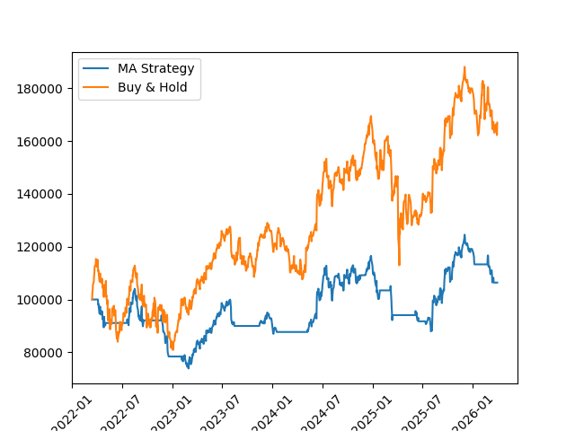

Building my brain back up by not using ANY AI for this project cuz i can :3

5/4/26
Built an MVP with a simple MA strategy and Buy & Hold benchmakr.
 
**How it works:** Loop through historical prices day by day. On each day, compute a fast MA (20-day) and slow MA (50-day). Fast crosses above slow -> buy. Fast crosses below slow -> sell. First 49 days are warmup since we need 50 prices to start.
 
**Key things I learned:**
- A backtester is just a for-loop that replays history and keeps score
- `history[-50:]` gives the last 50 items (sliding window, didnt know you can use negatives)
- `.iloc[i]` for positional indexing when pandas uses dates as the index and not normal nubers (1,2,3,4,... etc)
- `.squeeze()` to flatten a single-column DataFrame into a Series
- Track leftover cash after buying, don't set it to zero as i did by just rounding
 
**Built so far:** MA crossover strategy, portfolio tracking, equity curve plotting, buy & hold benchmark comparison.
 
**Finding:** Buy and hold crushed the MA strategy on AAPL 2022–2026 (see image below). The strategy kept missing big moves by sitting in cash.
